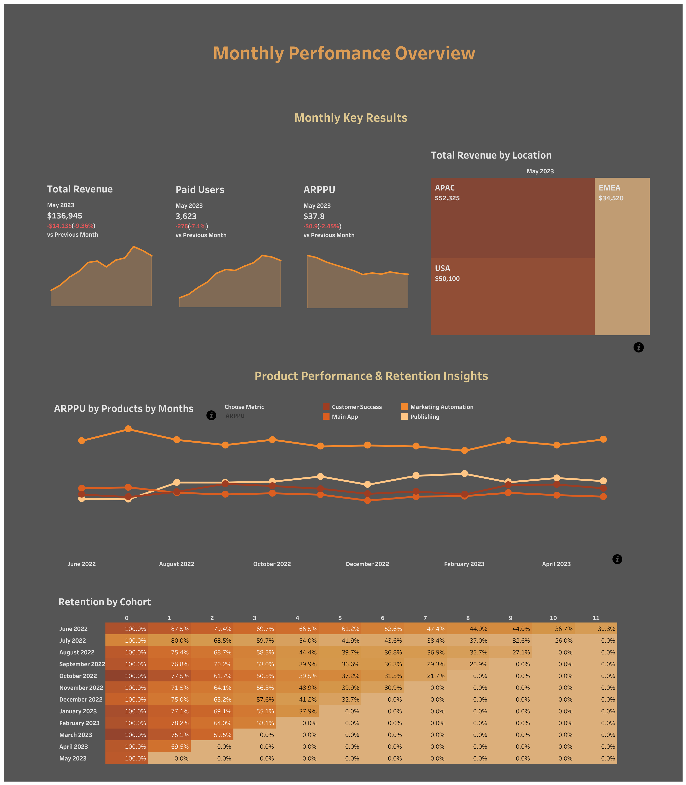

Revenue & Product Performance Dashboard

Overview

This project is an interactive analytics dashboard designed to analyze revenue, monetization, product performance, and user retention over time.
The dashboard supports exploratory analysis and decision-making through dynamic filters, actions, and cohort-based insights.

It is built to answer key business questions:
	•	What drives revenue changes month-over-month?
	•	Which locations and products contribute most to growth or decline?
	•	Are revenue changes driven by user volume or monetization?
	•	How does product performance relate to user retention?

⸻

Key Features

Monthly Key Results
	•	Core KPIs: Revenue, Paid Users, ARPPU
	•	Comparison vs previous month (MoM)
	•	Trend lines across all available months for context

This block provides a quick executive-level snapshot while preserving historical perspective.

⸻

Revenue by Location
	•	Total revenue by country for the selected month
	•	Click on a country to dynamically filter:
	•	All charts
	•	KPI cards
	•	Product and retention analysis

This enables fast market-level drill-down and impact analysis.

⸻

Product Performance by Month
	•	Metric selector to switch between:
	•	Paid Users
	•	Revenue
	•	ARPPU
	•	Line chart showing monthly dynamics by product
	•	Click on a product line to:
	•	Update KPI cards
	•	Display cohort-based retention for the selected product

This allows comparison of product growth patterns and monetization efficiency.

⸻

Cohort Retention Analysis
	•	Monthly cohort retention visualization
	•	Automatically updates based on selected product
	•	Helps identify:
	•	Early churn patterns
	•	Long-term retention strength
	•	Differences in user behavior across products

⸻

Dashboard Navigation & UX
	•	Info icons explain how to interact with the dashboard using actions
	•	Tooltips are available across all charts for additional context
	•	Designed to balance flexibility with clarity, avoiding visual overload

⸻

Interaction Logic (Actions)

The dashboard heavily relies on interactive actions:
	•	Country selection → global filter
	•	Product selection → KPI + retention update
	•	Metric selector → dynamic chart recalculation

This makes the dashboard exploratory rather than static, encouraging deeper analysis without requiring technical knowledge.

⸻

Use Cases
	•	Executive monthly performance review
	•	Product performance comparison
	•	Market-level revenue analysis
	•	Retention diagnostics for monetization decisions
	•	Identifying growth drivers and underperforming segments

⸻

Tools & Skills Demonstrated
	•	KPI design and metric hierarchy
	•	MoM and trend analysis
	•	Cross-filtering and dashboard actions
	•	Cohort-based retention analysis
	•	UX-focused analytical dashboard design
	•	Data storytelling for business stakeholders

⸻

Outcome

The dashboard enables stakeholders to move from high-level performance monitoring to granular product and market insights within a single analytical space, supporting data-driven product and marketing decisions.

Links
- [Tableau Dashboard](https://public.tableau.com/views/MonthlyPerfomanceOverview/MonthlyPerfomanceOverview?:language=en-US&publish=yes&:sid=&:redirect=auth&:display_count=n&:origin=viz_share_link)
