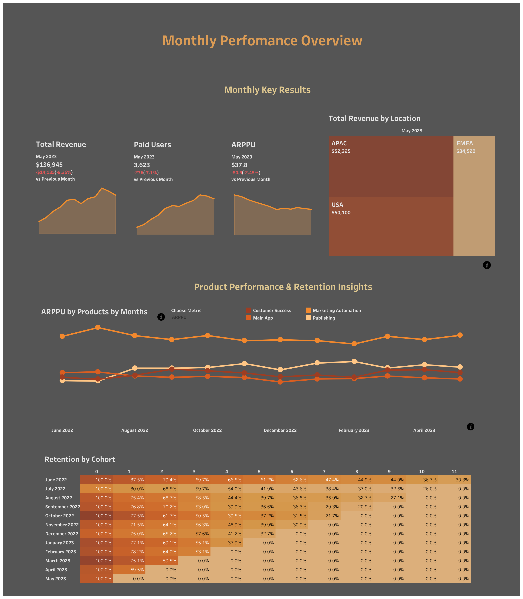

## Revenue & Product Performance Dashboard

## Project Overview

This project focuses on the analysis of monthly revenue, the number of paying users, ARPPU, product performance, and user retention.

The main goal is to provide a high-level overview of business performance, track month-over-month changes, and understand which products and regions have the strongest impact on revenue dynamics.

The dashboard combines an executive-level overview of key KPIs with deeper product and retention analysis. It allows users to monitor core business metrics, compare the current month with the previous month, analyze product trends over time, and evaluate retention by cohorts.

## Key Metrics

- **Total Revenue** — total monthly revenue generated by paying users

- **Paid Users** — the number of users who made a payment in the selected month

- **ARPPU** — average revenue per paying user

- **MoM Change** — comparison of the selected month’s performance with the previous month

- **Retention Rate** — the percentage of users who remain active during the following periods of the cohort lifecycle

## Dashboard Sections

### Monthly Key Results

This section provides a quick overview of key business metrics for the selected month:

- Total Revenue

- Paid Users

- ARPPU

- absolute and percentage change compared to the previous month

It helps quickly understand whether the business is growing or declining and which metric has the strongest impact on the overall dynamics.

### Total Revenue by Location

This section shows revenue distribution across key regions:

- USA

- EMEA

- APAC

It helps identify which regions generate the highest revenue and how revenue is distributed geographically.

This visualization also works as an interactive location filter for the entire dashboard: users can click on a specific location, and all dashboard sections will be filtered by the selected region.

### Key Metrics by Products by Months

This chart shows the dynamics of key metrics by product across months.

Using the **Choose Metric** selector, users can choose the metric for analysis:

- Revenue

- Paid Users

- ARPPU

Products included in the analysis:

- Customer Success

- Main App

- Marketing Automation

- Publishing

This visualization also works as an interactive product filter for the entire dashboard: users can click on a specific product, and all dashboard sections will be filtered by the selected product.

### Retention by Cohort

This section shows user retention by monthly cohorts.

It helps understand how well users are retained over time and compare retention between different acquisition months.

The cohort heatmap makes it possible to identify stronger and weaker cohorts, as well as analyze how retention changes across different stages of the user lifecycle.

## Key Business Questions

The dashboard helps answer the following questions:

- How do revenue, the number of paying users, and ARPPU change month-over-month?

- Which regions contribute the largest share of revenue?

- Which products show the strongest growth in paying users, revenue, and ARPPU?

- Are revenue changes driven more by the number of paying users or by monetization?

- Which cohorts demonstrate stronger long-term retention?

## Key Insights

There is an overall decline in key business metrics: **Revenue decreased by 16.69%**, the number of paying users decreased by **12.1%**, and ARPPU decreased by **5.26%**. This indicates that the revenue decline was not only caused by a lower average revenue per paying user, but was mainly driven by a decrease in the number of paying users.

The dynamics differ by region, so the decline is not uniform. This may indicate differences in traffic quality, user behavior, payment conversion, or retention across specific regions.

For **Main App** and **Customer Success**, the main Revenue decline is driven by a decrease in the number of paying users. Therefore, the key issue for these products is most likely not ARPPU, but a reduction in the monetized user base.

The cohort analysis shows that the **June 2022** cohort has the highest retention across almost the entire observation period. In later cohorts, retention gradually decreases, especially after **3–6 months**. It is also visible that early retention among newer cohorts became weaker, which may indicate changes in acquired user quality, traffic channels, or product engagement.

The **5–6 month** period appears to be an important point for retention and reactivation activities, as churn may increase at this stage.

## Recommendations

The main focus should be on identifying the reasons behind the decrease in the number of paying users, especially for **Main App** and **Customer Success**, since this factor has the strongest impact on the Revenue decline.

The first areas to check are:

1. **Acquisition / traffic quality**

   Analyze whether acquisition channels, marketing campaigns, or regions that bring users have changed. If newer cohorts retain worse, the company may be acquiring a lower-quality audience.

2. **Conversion to payment**

   Check whether the conversion from active user to paying user has decreased. To do this, analyze the funnel before payment: registration → activation → trial/payment → paid user.

3. **Retention and churn of paying users**

   Since cohorts after **June 2022** retain worse, identify at which stage users are more likely to leave, especially after **3–6 months**.

4. **Regional differences**

   For regions with the strongest Revenue decline, split the change into **Paid Users** and **ARPPU**.

   If **Paid Users** are decreasing, the focus should be on traffic, conversion, and retention.

   If **ARPPU** is decreasing, pricing, subscription plans, discounts, upsell, and cross-sell should be reviewed.

5. **Reactivation at month 5–6**

   Since this period looks like a point where churn may increase, retention campaigns can be tested: personalized offers, email/push reminders, renewal discounts, bonuses, or special conditions for users at risk of churn.

## Tools Used

- **Tableau** — dashboard creation and data visualization

- **SQL** — data preparation and metric calculation

# Links

- [Tableau Dashboard](https://public.tableau.com/views/MonthlyPerfomanceOverview/MonthlyPerfomanceOverview?:language=en-US&publish=yes&:sid=&:redirect=auth&:display_count=n&:origin=viz_share_link)
